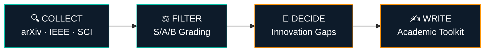
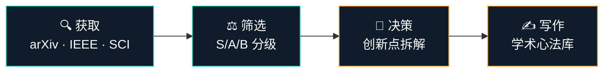

<div align="center">

# 🔬 Research Daily

### AI-Powered Research Report System for IC · EE · AI

[](LICENSE)
[](https://github.com/Destined-at-Dawn/research-daily/releases)
[](https://github.com/Destined-at-Dawn/research-daily/stargazers)

**每天 5 分钟，掌握前沿动态。输入一篇文献，输出一片天地。**

*Not another paper aggregator — a decision engine that tells you what to read.*

[English](#-english) · [中文](#-中文) · [Quick Start](#-quick-start) · [Download Skill](https://github.com/Destined-at-Dawn/research-daily/releases/latest)

</div>

---

## 🇺🇸 English

### Why Research Daily?

Every tool says: *"Here are 50 new papers."*
Nobody says: *"Read these 3, skip the rest."*

**Research Daily is different.** It's a three-stage rocket:



### Key Features

| Feature | What it does |
|:--------|:-------------|
| 📰 **Daily Research Report** | Automated paper discovery with S/A/B grading + decision rationale |
| 📊 **Paper Panoramic Analysis** | Input title/DOI/PDF → structured analysis card |
| 💡 **Innovation Gap Finder** | 7-dimension dissection + 6-type Research Gap framework |
| 🔀 **Multi-Paper Comparison** | Differential matrix + trend identification |
| ✍️ **Academic Writing Toolkit** | Writing formulas from top-journal paper teardowns |
| 🧑‍⚖️ **Peer Review Simulator** | Reviewer-perspective feedback on your draft |
| 📚 **Cognitive Reading System** | S/A/B tiered methodology for building research foundations |

### Covered Domains

| Domain | Sources | Target Venues |
|:-------|:--------|:--------------|
| **AI / ML** | cs.AI, cs.LG, cs.CV, cs.CL, stat.ML | NeurIPS, ICML, ICLR, AAAI |
| **Integrated Circuits** | IEEE Xplore | JSSC, ISSCC, DAC, VLSI |
| **Electrical Engineering** | eess.SY, eess.SP, physics | TPEL, TIE, ECCE |
| **Interdisciplinary** | physics, math.OC | Nature / Science sub-journals |

### Five Workflows

| ID | Name | Trigger |
|:---|:-----|:--------|
| **A** | Paper Input → Panoramic Analysis | Paste a paper title / DOI / PDF |
| **B** | Daily Research Report | *"Generate today's report"* |
| **C** | Innovation Gap Engine | *"What can I work on?"* |
| **D** | Writing Formula Library | *"Why is this paper so well-written?"* |
| **E** | Research Guidance | *"Help me plan"* / *"Review my draft"* |

---

## 🇨🇳 中文

### 解决什么问题？

调研了 4 个同类工具（news-bot、daily-arXiv-ai-enhanced、ChatDailyPapers、Arxiv-tracker），发现共同空白：

> **所有工具都在做"获取更多信息"，没人做"帮你决定读不读"。**

### 三级火箭架构



### 五大工作流

| 工作流 | 功能 | 触发方式 |
|:-------|:-----|:---------|
| **A** | 文献输入 → 智能匹配与全景分析 | 输入论文标题/DOI/PDF |
| **B** | 每日科研日报生成 | "生成今日日报" / 定时触发 |
| **C** | 创新点发现引擎 | "创新点是什么" / "还有什么可以做" |
| **D** | 学术写作心法库 | "这篇论文怎么写这么好" |
| **E** | 科研指导 + 审稿模拟 | "帮我规划" / "帮我审稿" |

### 日报模块

| 模块 | 内容 | 筛选标准 |
|:-----|:-----|:---------|
| 🔥 **今日突破** | 1-2 条重大突破 | 影响力大 + 领域直接相关 |
| 📄 **前沿论文** | 3-5 篇 S/A 级论文 | 含分级决策理由 |
| 💡 **技术洞察** | 论文间联系/趋势/交叉方向 | 引用链追踪 + 跨领域观察 |
| 🛠️ **工具与代码** | 开源工具/复现代码 | 可复现/可学习 |
| 📅 **明日关注** | 截稿/会议/事件预告 | 领域相关 |
| 📊 **学习笔记** | 可汇入认知系统的提炼 | 从论文中提取的可学点 |

### S/A/B 分级系统

| 级别 | 标准 | 处理方式 |
|:-----|:-----|:---------|
| **S 级** | 顶刊 + 重大突破 + 高度相关（≥3 项） | 逐字精读 → 进入科研认知系统 |
| **A 级** | 满足至少 2 项条件 | 精读 abstract + introduction + 结论 |
| **B 级** | 满足不到 2 项 | 一句话跳过 |

### 创新点发现：七维解剖 × 六类 Gap

<details>
<summary><b>📐 七维创新分析</b></summary>

1. 问题定义 — 这篇论文解决的问题是否是真正的问题？
2. 方法设计 — 方法的创新在哪里？和已有方法的本质区别？
3. 理论框架 — 理论贡献是否坚实？
4. 实验验证 — 实验设计是否充分？是否可复现？
5. 数据资源 — 数据集的贡献？是否开放？
6. 应用场景 — 实际应用价值？
7. 性能表现 — 指标提升是否显著？

</details>

<details>
<summary><b>🕳️ 六类 Research Gap</b></summary>

1. **理论缺口** — 现有理论无法解释的现象
2. **方法缺口** — 现有方法的性能瓶颈
3. **应用缺口** — 技术未被应用到的场景
4. **数据缺口** — 缺乏数据集或标注
5. **实证缺口** — 假设未被实验验证
6. **人口缺口** — 未被研究覆盖的人群/场景

</details>

### 核心原则

1. **输入即分析** — 输入任何文献信息，自动关联已有文献、定位创新点
2. **对比出创新** — 创新不是凭空想出来的，是比出来的
3. **从文献到写作的闭环** — 分析 → 认知 → 写作心法 → 可转化材料

---

## 🚀 Quick Start

### Option A: Plugin Marketplace (Recommended)

```shell
/plugin marketplace add Destined-at-Dawn/research-daily
/plugin install research-daily@research-daily
```

### Option B: Manual Download

#### 1. Download the Skill

```bash
# Latest release
gh release download v1.0.0 \
  --repo Destined-at-Dawn/research-daily \
  --pattern "*.yaml"
```

Or grab the latest `.yaml` from [Releases](https://github.com/Destined-at-Dawn/research-daily/releases/latest).

### 2. Install

Drop the `.yaml` file into your AI assistant's skill directory.

### 3. First Run

The system guides you through a 4-step onboarding:

```
Field Positioning → Paper Baseline → Reading Mode → Innovation Focus
```

### 4. Daily Use

```bash
"生成今日科研日报"          # Generate today's report
"帮我看看这篇论文"          # Analyze a paper
"这个方向还有什么可以做？"    # Find innovation gaps
"对比这几篇论文"            # Multi-paper comparison
"帮我审一下这篇论文"        # Peer review simulation
```

---

## 📁 Project Structure

```
research-daily/
│
├── 科研日报/                          ← Core System
│   ├── README.md                     ← System documentation
│   ├── 科研日报-skill.yaml            ← AI Skill definition (v2.1)
│   ├── 与科研认知的衔接.md             ← Report → Deep Reading pipeline
│   ├── 配置/
│   │   ├── 信息源.md                 ← arXiv / IEEE / SCI sources
│   │   ├── 领域关键词.md              ← IC / EE / AI keyword system
│   │   ├── SAB分级标准.md             ← S/A/B grading criteria
│   │   └── 自动化配置.md              ← Scheduled task config
│   ├── 复盘/
│   │   └── README.md                 ← Review system
│   └── 科研论文/
│       └── 元数据笔记.md              ← Paper metadata example
│
└── 科研认知/                          ← Companion System
    ├── README.md                     ← System documentation
    ├── 文献阅读体系.md                ← 100-paper reading methodology
    └── readings/                     ← Deep reading records
```

---

## 🤝 Contributing

Issues and pull requests are welcome. For major changes, please open an issue first to discuss what you would like to change.

## 📄 License

This project is licensed under the [GNU General Public License v3.0](LICENSE).

---

<div align="center">

**Built by [Destined-at-Dawn](https://github.com/Destined-at-Dawn)**

*If this project helps your research, consider giving it a ⭐*

</div>
